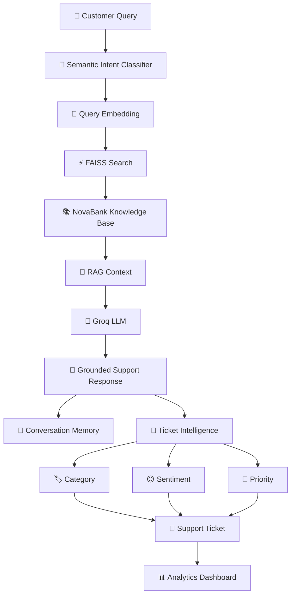
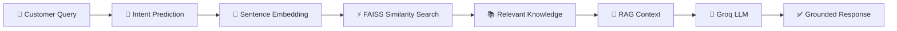
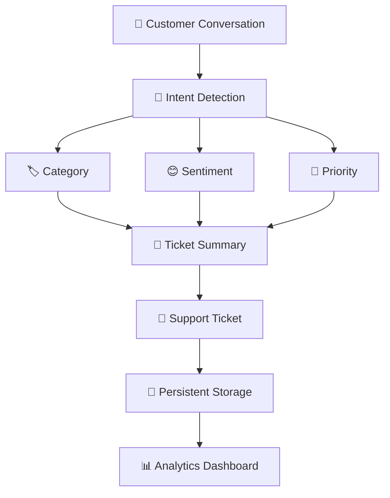
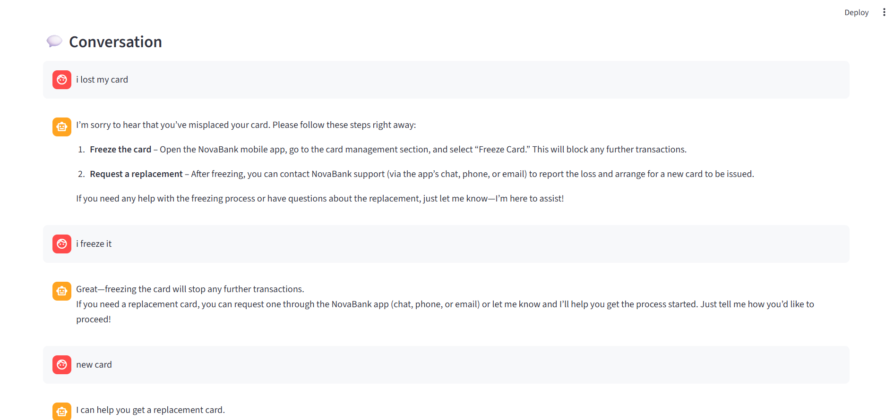
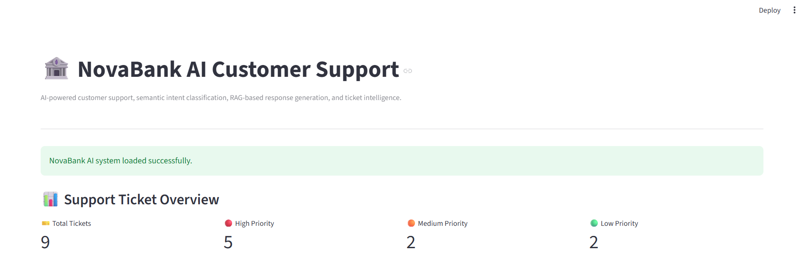

# 🏦 NovaBank AI Support

### 🤖 AI-Powered Banking Customer Support & Ticket Intelligence System

<p align="center">
  <b>Semantic NLP • RAG • FAISS • LLM • Conversation Memory • Ticket Intelligence • Streamlit</b>
</p>

<p align="center">
  
  
  
  
  
  
</p>

---

## 🌟 Overview

**NovaBank AI Support** is an end-to-end AI-powered banking customer support system designed to understand customer queries, retrieve relevant banking information, generate grounded responses, and automatically convert conversations into structured support tickets.

The system combines **Machine Learning, Natural Language Processing, Semantic Search, Retrieval-Augmented Generation (RAG), LLMs, and Streamlit** into a single customer-support workflow.

> 💡 **Goal:** Build a practical AI support system that can understand customers, answer their questions using trusted knowledge, remember conversations, and assist support teams with automated ticket intelligence.

---

## ✨ Key Features

| Feature                               | Description                                       |
| ------------------------------------- | ------------------------------------------------- |
| 🧠 **Semantic Intent Classification** | Understands the meaning behind customer queries   |
| 🔎 **FAISS Vector Search**            | Retrieves the most relevant banking knowledge     |
| 📚 **RAG Pipeline**                   | Grounds LLM responses using NovaBank knowledge    |
| 🤖 **LLM Response Generation**        | Generates natural-language customer responses     |
| 💬 **Conversation Memory**            | Maintains context across multiple turns           |
| 🎫 **Ticket Intelligence**            | Converts conversations into structured tickets    |
| 🏷️ **Category Detection**            | Automatically categorizes support issues          |
| 😊 **Sentiment Analysis**             | Detects customer sentiment                        |
| 🚨 **Priority Detection**             | Assigns HIGH / MEDIUM / LOW priority              |
| 📊 **Analytics Dashboard**            | Provides ticket-level support analytics           |
| 💾 **Ticket Persistence**             | Stores generated tickets for future analysis      |
| 🔐 **Secure API Configuration**       | API keys are managed outside tracked source files |

---

# 🏗️ System Architecture



---

# 🔎 RAG Pipeline

NovaBank uses **Retrieval-Augmented Generation** to provide responses based on the bank's internal knowledge rather than relying only on the LLM's pretrained knowledge.



### 🔄 Pipeline Flow

**Customer Query**
↓
**Intent Classification**
↓
**Query Embedding**
↓
**FAISS Similarity Search**
↓
**NovaBank Knowledge Retrieval**
↓
**RAG Context Construction**
↓
**Groq LLM**
↓
**Grounded Customer Response**

---

# 🧠 Intent Classification

Two approaches were implemented and compared.

### 1️⃣ TF-IDF + Logistic Regression

A traditional NLP baseline using TF-IDF text features.

**Accuracy: 85.45%**

### 2️⃣ Sentence Embeddings + Logistic Regression

Customer queries are transformed into semantic embeddings using:

```text
all-MiniLM-L6-v2
```

The resulting **384-dimensional embeddings** are used for intent classification.

**Accuracy: 90.81%**

### 📈 Performance Comparison

| Model                                     |   Accuracy |
| ----------------------------------------- | ---------: |
| TF-IDF + Logistic Regression              | **85.45%** |
| Sentence Embeddings + Logistic Regression | **90.81%** |

🏆 **Improvement: +5.36 percentage points**

---

# 🤖 RAG + LLM Response Generation

After predicting the customer's intent, the system performs semantic retrieval from the NovaBank knowledge base.

### Retrieval Stack

```text
Customer Query
      ↓
Sentence Transformer
      ↓
384-Dimensional Embedding
      ↓
FAISS Index
      ↓
Relevant Knowledge Document
      ↓
RAG Context
      ↓
Groq LLM
      ↓
Customer Response
```

### 🧩 Technologies

* **Embedding Model:** `all-MiniLM-L6-v2`
* **Embedding Dimension:** 384
* **Vector Search:** FAISS
* **Knowledge Documents:** 18
* **LLM:** `openai/gpt-oss-120b`
* **LLM Provider:** Groq

---

# 💬 Conversation Memory

NovaBank supports multi-turn conversations instead of treating every customer message as an isolated query.

### Example

```text
Customer: I lost my card.

Assistant: I'm sorry to hear that. Please freeze your card...

Customer: I have already frozen it.

Assistant: That's a good first step...

Customer: Can I get a replacement?

Assistant: Yes, I can help you with the replacement process...
```

The conversation history is passed into the response-generation pipeline so the assistant can understand references to previous messages.

---

# 🎫 Ticket Intelligence

Customer conversations can automatically be transformed into structured support tickets.



### Generated Ticket Information

Each ticket can contain:

* 🎫 Ticket ID
* 🆔 Conversation ID
* 🎯 Intent
* 🏷️ Category
* 😊 Sentiment
* 📊 Sentiment Confidence
* 🚨 Priority
* 📝 AI-generated Summary
* 💡 Suggested Action
* 📌 Ticket Status

---

# 📊 Analytics Dashboard

The Streamlit dashboard provides an overview of support activity.

### Dashboard Capabilities

* 🎫 Total ticket count
* 🔴 High-priority tickets
* 🟠 Medium-priority tickets
* 🟢 Low-priority tickets
* 🏷️ Category distribution
* 🎯 Intent distribution
* 📈 Ticket analytics
* 🔍 Ticket Explorer
* 🔄 Ticket status management

---

# 🖥️ Application

The project is implemented using **Streamlit** to provide an interactive interface for both customer support and ticket intelligence.

### Main Workflow

```text
Customer
   ↓
Ask Banking Question
   ↓
AI Understands Intent
   ↓
Relevant Knowledge Retrieved
   ↓
LLM Generates Response
   ↓
Conversation Continues
   ↓
Generate Support Ticket
   ↓
Ticket Analytics
```

---

# 📁 Project Structure

```text
NovaBank-AI-Support/
│
├── 📓 01_intent_classification_and_rag_retrieval.ipynb
│   ├── Data preprocessing
│   ├── TF-IDF baseline
│   ├── Semantic embeddings
│   ├── Intent classification
│   └── FAISS retrieval
│
├── 📓 02_rag_response_generation.ipynb
│   ├── RAG pipeline
│   ├── Prompt construction
│   ├── Groq LLM integration
│   └── Conversation memory
│
├── 📓 03_ticket_intelligence.ipynb
│   ├── Category mapping
│   ├── Sentiment analysis
│   ├── Priority detection
│   ├── Ticket generation
│   └── Ticket analytics
│
├── 🚀 app.py
│   └── Main Streamlit application
│
├── 📂 data/
│   ├── multi_tickets.csv
│   ├── ticket_analytics.csv
│   └── tickets.csv
│
├── 📂 models/
│   ├── embedding_intent_classifier.pkl
│   ├── intent_classifier.pkl
│   ├── tfidf_vectorizer.pkl
│   ├── novabank_faiss.index
│   └── novabank_knowledge.pkl
│
├── 📄 README.md
├── 📄 requirements.txt
└── 📄 .gitignore
```

---

# 🛠️ Tech Stack

### 👨‍💻 Programming & Data

* 🐍 Python
* 🐼 Pandas
* 🔢 NumPy

### 🧠 Machine Learning & NLP

* Scikit-learn
* Sentence Transformers
* Transformers
* Logistic Regression
* TF-IDF

### 🔎 Retrieval & RAG

* FAISS
* Vector Embeddings
* Retrieval-Augmented Generation

### 🤖 Generative AI

* Groq
* `openai/gpt-oss-120b`

### 🖥️ Application

* Streamlit
* Matplotlib
* Seaborn

### 💾 Model Persistence

* Joblib

### 🌐 Version Control

* Git
* GitHub

---

# 📚 Dataset

The intent classification component uses the **Banking77** dataset.

The dataset contains banking-related customer queries covering **77 different intents**.

Examples include:

```text
lost_or_stolen_card
card_not_working
pending_transfer
cash_withdrawal_not_recognised
top_up_failed
verify_my_identity
exchange_rate
card_payment_not_recognised
```

---

# 🔐 API Configuration

The Groq API key is **not stored directly in the source code**.

Create:

```text
.streamlit/
└── secrets.toml
```

Add:

```toml
GROQ_API_KEY = "your_api_key_here"
```

The application accesses the key using:

```python
import streamlit as st
from groq import Groq

client = Groq(
    api_key=st.secrets["GROQ_API_KEY"]
)
```

⚠️ **Never commit `secrets.toml` or expose your API key publicly.**

---

# 🚀 Installation

### 1️⃣ Clone the repository

```bash
git clone https://github.com/secretashuboi/NovaBank-AI-Support.git
cd NovaBank-AI-Support
```

### 2️⃣ Create a virtual environment

```bash
python -m venv venv
```

Activate it on Windows:

```bash
venv\Scripts\activate
```

### 3️⃣ Install dependencies

```bash
pip install -r requirements.txt
```

### 4️⃣ Configure API key

Create:

```text
.streamlit/secrets.toml
```

and add your Groq API key.

### 5️⃣ Run the application

```bash
streamlit run app.py
```

---

# 🎯 Example Customer Queries

Try queries such as:

```text
💳 I lost my debit card.

💸 My transfer is still pending.

💰 My cash withdrawal is not showing correctly.

🔐 Why do I need to verify my identity?

💵 What exchange rate will I get?

💳 My card payment was declined.

📱 Can I get a virtual card?
```

---

# ⚠️ Limitations

Although the system demonstrates an end-to-end AI support workflow, several areas can be improved:

* Sentiment detection may classify some neutral banking queries as negative.
* Some closely related banking intents can be difficult for the classifier to distinguish.
* The current knowledge base is intentionally limited to NovaBank's demonstration content.
* LLM responses depend on the quality and coverage of retrieved context.
* Priority assignment currently uses rule-based logic for selected intents.

These limitations provide opportunities for future improvements.

---

# 🚀 Future Improvements

### 🔮 Planned Enhancements

* [ ] 🔐 Add authentication and role-based access
* [ ] 🧠 Improve intent classification for difficult intents
* [ ] 📚 Expand the NovaBank knowledge base
* [ ] 🎯 Add reranking to improve retrieval quality
* [ ] 🧩 Add hybrid search
* [ ] 🧠 Improve sentiment classification
* [ ] 🚨 Learn priority from historical ticket data
* [ ] 📊 Add advanced support-team analytics
* [ ] 💾 Add a production database
* [ ] ☁️ Deploy the application to the cloud
* [ ] 🔄 Add automated model monitoring
* [ ] 🧪 Add automated testing and CI/CD

---

# 🏆 Project Highlights

```text
🧠 Semantic Intent Classification
        ↓
📈 90.81% Classification Accuracy
        ↓
🔎 FAISS Vector Retrieval
        ↓
📚 RAG Knowledge Grounding
        ↓
🤖 Groq LLM Response Generation
        ↓
💬 Conversation Memory
        ↓
🎫 Automated Ticket Intelligence
        ↓
📊 Interactive Analytics Dashboard
```

---

# 🎓 Project Objective

The objective of **NovaBank AI Support** is to demonstrate how modern AI technologies can be combined to build a practical customer-support system.

Rather than implementing a standalone chatbot, this project connects:

**Machine Learning + NLP + Semantic Search + RAG + LLMs + Ticket Intelligence + Analytics**

into one complete workflow.

---

# 👨‍💻 Author

### **Ashutosh Yadav**

🎓 B.Tech CSE — AI/ML
💡 Interested in Machine Learning, Data Science & Generative AI

<p align="center">

⭐ If you found this project interesting, consider giving it a star!

</p>

---

## 📌 Project Repository

🔗 **GitHub:**
https://github.com/secretashuboi/NovaBank-AI-Support

---

<p align="center">
  <b>🏦 NovaBank AI Support</b><br>
  <i>Turning customer conversations into intelligent support.</i>
</p>

## 🎥 Demo

The application provides an interactive Streamlit interface for AI-powered customer support, including:

- 🤖 Intent classification
- 📚 RAG-based response generation
- 💬 Conversation memory
- 🎫 Automated ticket generation
- 📊 Ticket intelligence and analytics

🔗 **Live Demo:** [Try NovaBank AI Support](https://novabank-ai-support-by-ashu.streamlit.app/)

## 📸 Screenshots

### 💬 AI Customer Support Conversation



### 📊 Ticket Intelligence Dashboard

